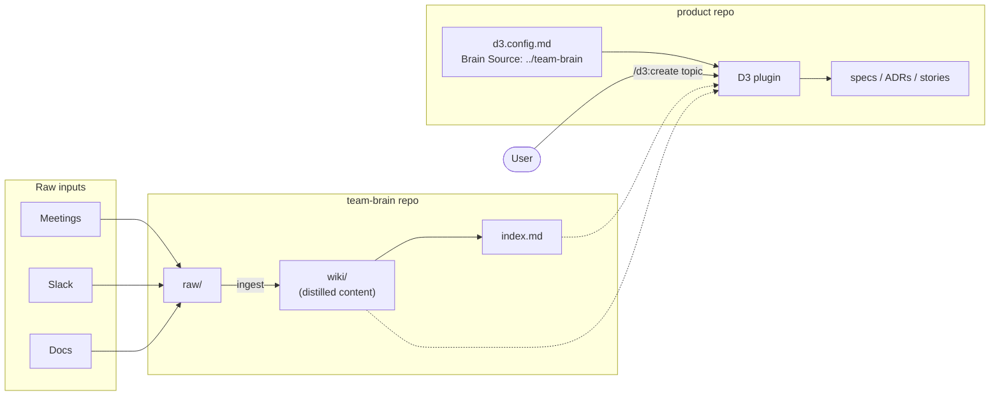
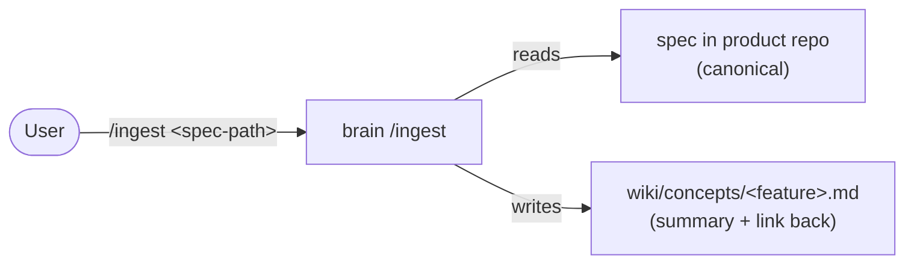

# LLM Wiki Integration — Design

Progress and tasks: see [`PLAN.md`](./PLAN.md).

## Goal

Add a team-wide knowledge repo ("brain" / llm-wiki) as an optional input source for D3. Teams using the brain stop pasting transcripts into D3 and ask D3 to pull relevant context from the wiki.

Inspiration: https://gist.github.com/karpathy/442a6bf555914893e9891c11519de94f

## Repos

- **product repo** — source code. Installs D3 plugin. Holds D3-generated artifacts only.
- **team-brain repo** — knowledge store. Raw inputs + distilled wiki. Multi-product. No D3 plugin.
- **d3 plugin repo (this one)** — the plugin. Consumed by product repos.

### Why the brain is a separate repo

- Different lifecycle (append-heavy knowledge vs versioned code).
- Different access control (transcripts may contain sensitive content).
- Multi-product reality (knowledge rarely maps 1:1 to one codebase).
- Scale (raw transcripts outweigh code quickly).
- Tooling independence (may migrate to Confluence/Notion/vector DB later — keep that a config change).

## Brain contract (what D3 needs from any llm-wiki)

D3 is not coupled to any specific brain layout. It needs only:

- An **entry-point index file** the brain exposes at a known path (configured via `Brain Source` + conventional filename, e.g. `index.md`).
- Entries in that index with **topic-bearing titles** and links to readable markdown files.
- Files reachable by following those links (relative paths, plain markdown).

Everything else — folder structure, categorisation, brain-side commands — is the brain repo's business and varies per team.

## Diagram

Solid = writes. Dashed = reads. Brain is read-only from D3's side.

On `/d3:create` (and `/d3:refine`): the plugin reads the index, keyword-matches the topic, reads the matched wiki files, and writes an artifact to the product repo. No `/ingest` involved — that's a separate flow, covered below.

## Retrieval flow (D3 side)

1. Read the brain's entry-point index file.
2. Keyword-match the user's topic against entry titles across all sections (case/punctuation/whitespace tolerant).
3. If hub pages are linked from the index (project overview, topic hub), optionally read them to discover further relevant links.
4. Confirm matched files with the user before reading.
5. Read the confirmed files and feed them as input context to the existing `create` / `refine` flow.

Rules:
- Missing/malformed index → warn and fall back to paste flow. Never hard-fail.
- D3 never writes to the brain.
- Supersession, freshness, and conflict resolution are the brain's responsibility (typically via dated files).

Known limitations:
- Retrieval quality depends entirely on ingest quality (topic keywords must appear in titles).
- No alias layer — title drift between ingestions causes misses.

## Publishing D3 outputs to the brain (brain side)

The brain is discoverable team knowledge for any consumer — humans, other LLMs, other tools — not only D3. Without a way to surface D3-produced specs there, the brain only ever sees inputs (transcripts, slack threads) and never outputs (what the team decided to build). That's a gap.

The fix is brain-side, not D3-side: the brain's `/ingest` command gains a path-arg mode that takes a spec file and registers it in the wiki.

### Flow

Separate from `/d3:create` — this runs in the brain repo, initiated by a human, only when the spec is ready to be discoverable.

### Workflow

1. D3 writes a spec to the product repo as normal. The product repo stays the **canonical source of truth** — version-controlled, reviewed in PRs, evolves alongside the code.
2. When the spec is ready to be discoverable team-wide, a human runs `/ingest <path-to-spec>` in the brain repo, pointing at the product repo's spec file.
3. The brain detects the input is a spec (by frontmatter, path pattern, or template structure) and produces/updates `wiki/concepts/<feature-slug>.md` with:
   - Title and summary/scope extracted from the spec
   - Key decisions pulled out as links into `wiki/decisions/` where applicable
   - A prominent **link back to the canonical spec** in the product repo (relative path or git URL)
   - A `last_updated` timestamp
4. Updates `wiki/index.md` and the project hub's "Built features" list.
5. Idempotent by slug — re-ingesting an updated spec updates the concept page in place.

### Why this shape

- **Canonical stays in the product repo.** Specs live next to the code they describe. Nothing changes in dev workflow, code review, or versioning.
- **Brain gains discoverability.** Humans and LLMs searching the brain find concept pages that point them at the canonical spec.
- **No telephone-game loop.** The brain's concept page is a *reference*, not a rewrite. When D3 later refines the spec, it reads the spec in the product repo (the canonical), not the brain's distilled representation. Drift cannot compound.
- **Different from transcript ingest.** A transcript is a raw conversation — ingest cleans it and extracts decisions. A spec is already authoritative — ingest just surfaces a summary + link, without rewriting.
- **Manual, not automatic.** V1 relies on a human running `/ingest`. Auto-watching product repos is a later concern; same as auto-ingesting transcripts from meeting recorders.

### Unresolved sub-questions

- **Path format.** Relative paths work for local testing; a real deployment wants git URLs so links survive repo moves and work for team members with different clone locations.
- **Re-ingestion cadence.** Every refine or only at milestones? Over-ingesting churns the concept page without adding signal. Likely: manual, user decides when the spec is "ready."
- **ADR extraction.** If a spec references existing ADRs, should ingest cross-link them? If it contains new decisions, should ingest emit a decision file too? Probably yes to both, but shape TBD.

## D3 changes (on branch `llm-wiki`)

- `config-samples/*.md` — optional `Brain Source` setting.
- `d3/skills/create/SKILL.md` — reads Brain Source; step 3 gains option D when set.
- `d3/skills/refine/SKILL.md` — reads Brain Source; step 5 gains option F; defaults to current artifact title.
- Nothing removed. Paste-based flow still works.

## Reference brain (used for validation)

Located at `/Users/asier/dev/play/team-wiki-d3/team-brain`.

Structure:
- `raw/` — inputs (`meetings/`, `slack/`, `other/`).
- `wiki/` — distilled output (`summaries/`, `decisions/`, `concepts/`, `projects/`, `people/`).
- `wiki/index.md` — entry point.
- `.claude/commands/` — brain-side `/ingest`, `/query`, `/lint`.

Seed product: **Pageturner**, a used-book marketplace. 5 transcripts across kickoff, roadmap, ceremonies, refinement, and a three-amigos. Ingestion produced summaries + dated decisions (including one that supersedes a refinement open question) + a concept page + a project hub.

## Open questions

- ~~Publish D3-generated artifacts back to the brain?~~ **Resolved** — see [Publishing D3 outputs to the brain](#publishing-d3-outputs-to-the-brain-brain-side). Short version: brain-side ingest, not D3-side publish.
- ~~Remove `distill` / drop Transcripts artifact row once brain flow is proven?~~ **Decided: keep.** Brain is an alternative path, not a replacement. Teams without a brain still need `distill` and `/d3:create transcript`.
- Topic taxonomy discipline — how to prevent naming drift across ingestions?

## Out of scope / future

- MCP server / remote API integration for the brain.
- Auth, access control, multi-tenant brains.
- Embeddings / semantic search.
- Automate ingestion (Slack bot, meeting recorder integration, scheduled pulls). Core logic already exists in the brain's ingest prompt — open question is trigger + quality.
