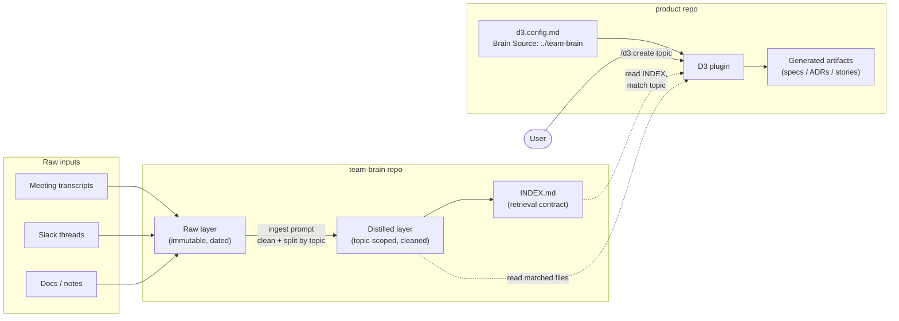

# LLM Wiki (Team Brain) — Integration Plan

## Goal

Add a team-wide knowledge repository ("brain") as an optional input source for D3. Teams using the brain stop pasting transcripts into D3 and instead ask D3 to pull the relevant context from the wiki.

Inspiration: https://gist.github.com/karpathy/442a6bf555914893e9891c11519de94f

## Repos and responsibilities

Three separate repos. Each has one job.

- **Product repo** — source code for a product. Installs the D3 plugin. Contains only D3-generated artifacts (specs, ADRs, stories).
- **Team brain repo** — team-wide knowledge. Raw transcripts, slack threads, docs. Multi-product. Long-lived, append-heavy. No D3 plugin installed here.
- **D3 plugin repo (this one)** — the plugin. Product teams install it; they don't maintain it.

### Why the brain is a separate repo

- Different lifecycle (append-heavy knowledge vs versioned code).
- Different access control (transcripts may include sensitive content).
- Multi-product reality (knowledge rarely maps 1:1 to one codebase).
- Scale (raw transcripts will outweigh code; cloning product repo shouldn't mean pulling 2GB of meeting dumps).
- Tooling independence (the brain may outgrow "repo" entirely — vector DB, Confluence, Notion — keeping it separate makes that migration a config change).

## Architecture

### Diagram



Solid arrows = writes. Dashed arrows = reads. The brain is read-only from D3's perspective.

### Layers inside the brain

- **Raw** — immutable, dated, source-tagged. Full transcripts, slack dumps, uploaded docs.
- **Distilled** — topic-scoped, cleaned. One file per topic, noise removed. This is what D3 retrieves.
- **Synthesized** (optional, later) — feature pages aggregating across meetings.

Without this split, retrieval quality collapses as the brain grows.

### Retrieval contract

The brain exposes an `INDEX.md` at the root. Flat list, one entry per file:

```
- [topic-slug](path.md) — one-line hook
```

D3 reads INDEX.md, matches the topic requested by the user, confirms the files picked, then reads them.

Deliberately trivial format so any wiki tooling can produce it. No embeddings, no search infra for v1.

### Connection mechanism (filesystem, v1)

D3 config gains one optional setting:

```
- Brain Source: ../team-brain
```

Claude's existing `Read`/`Grep`/`Glob` tools do the rest. No new dependencies, no MCP server, no API. Works day one.

Future options, deferred:
- **MCP server** on the brain for structured `query(topic)` calls — better retrieval, more infra.
- **Remote URL/API** (Confluence, Notion) — real product, real auth.

## D3 changes (already made on branch `llm-wiki`)

Kept small. Nothing removed. Teams not on the brain keep working unchanged.

- **`config-samples/*.md`** (all 3 variants) — added optional `Brain Source` setting, default `_none_`.
- **`d3/skills/create/SKILL.md`**
  - Step 1 reads `Brain Source`.
  - Step 3 gains option **D) Pull context from the team brain**, conditional on `Brain Source` being set.
  - Retrieval flow: read `INDEX.md` → match topic → show matches → confirm → read files → feed into existing create flow.
  - Brain is read-only from D3's side.
- **`d3/skills/refine/SKILL.md`**
  - Step 1 reads `Brain Source`.
  - Step 5 gains option **F) Pull new information from the team brain**.
  - New step 5c mirrors create's retrieval flow; defaults to the current artifact's title when no topic given.

**Deliberately untouched:** `distill`, `capture-transcript` (if it exists), `init`. Old flows still work.

## Brain ingest — scope

Brain ingest is the wiki repo's own prompt, owned by that repo. It is **not** a reuse of D3's `distill` — the two jobs look similar but have different requirements, and coupling them would re-create the repo coupling this plan is trying to avoid.

### Why brain ingest is not distill

- **Different horizon.** `distill` cleans a transcript for immediate consumption by `create`. The brain stores knowledge for repeated retrieval over months. That changes what gets preserved.
- **Different split rule.** `distill` splits aggressively so each output maps to one spec. The brain often wants to keep per-meeting chronology (same topic across 4 meetings = 4 files, not 1 merged file) because supersession matters.
- **Different output shape.** `distill` optionally applies a D3 template. The brain should not know D3 templates exist — it produces raw-plus-metadata.
- **Coupling risk.** If brain ingest "reuses distill logic," any D3 change to `distill` leaks into the brain.

### What brain ingest does

- Removes obvious noise (greetings, filler, meta-chatter).
- Tags each file with source metadata: date, type (meeting / slack / doc), participants where available, link back to the original.
- Labels each file with a topic slug for `INDEX.md` — does not necessarily split by topic.
- Updates `INDEX.md` on every ingestion, using the pinned format (`- [topic-slug](path.md) — one-line hook`).
- Idempotent: re-ingesting the same source doesn't create duplicates.

### What brain ingest does NOT do

- Apply D3 templates.
- Merge multiple sources into a single synthesized file (that's a later, separate "synthesized" layer).
- Generate specs, ADRs, or any D3 artifact — that is D3's job, downstream.

## Open design questions (to validate, not decide yet)

1. **Should D3-generated artifacts be published back into the brain?**
   - Pro: specs/ADRs are team knowledge.
   - Con: telephone-game drift — D3 reads back its own output as "team knowledge" and hallucinations compound.
   - Tentative answer: yes, but one-way, in a separate `decisions/` namespace, tagged as generated. Retrieval for new specs prefers raw+distilled over generated.

2. **Freshness / conflicting info across meetings.**
   - Meeting 1 says X, meeting 3 reverses it. Brain needs timestamps and a way to mark superseded content. Otherwise specs mix stale decisions.

3. **Topic taxonomy.**
   - "product recs" vs "recommendation engine" — retrieval breaks on naming drift. INDEX.md slugs need discipline.

4. **Should `distill` / `capture-transcript` eventually be removed from D3?**
   - Logically they belong in the brain repo (ingestion, not spec generation).
   - Moving them requires the brain repo to have its own ingestion tooling (prompts or a small plugin).
   - **Not doing this yet.** This plan validates the brain-as-input flow first. Removal is a separate, later step once the pattern is proven.

## Validation plan

### Step 1 — build a test brain repo

Create `team-brain/` on the filesystem, sibling to a fake product repo.

- `CLAUDE.md` with ingest instructions (see "Brain ingest — scope" below). Written fresh for the brain's needs — not a copy of D3's `distill`.
- `INDEX.md` at root — maintained by the ingest prompt.
- Folders for content: `transcripts/`, `slack/`, `docs/`.

Seed with fake data across **2 topics**:

- **product-recommendation** — split across 2 meeting transcripts + 1 slack thread. This tests the multi-source aggregation that is the main pain point driving this work.
- **checkout-fees** — 1 meeting.

### Step 2 — build a test product repo

Create `fake-product/` on the filesystem.

- Install the local D3 plugin.
- Run `/d3:init`.
- Edit `d3.config.md`: `Brain Source: ../team-brain`.
- Try: `/d3:create product-spec product-recommendation`.

### Step 3 — things to specifically check

1. Does D3 find the right files? (retrieval sanity)
2. Does it correctly aggregate across multiple sources for one topic? (the main value prop)
3. What happens when the topic is ambiguous — does the confirmation step catch it?
4. What happens when `INDEX.md` is missing or malformed? (fallback to paste flow)
5. Does `/d3:refine` with option F pull the right *delta*, or does it re-ingest everything already incorporated?
6. Noise: does the brain surface off-topic mentions from transcripts not really about the topic?

### Known risks to watch during the test

- **Stale INDEX.md** → wrong files pulled. Ingest prompt must keep it current.
- **Topic name mismatch** → confirmation step is the safety net. If it doesn't catch mismatches, retrieval logic needs more structure (tags, aliases).
- **Format drift** across wiki instances → pin the exact INDEX.md shape in the wiki's `CLAUDE.md`.
- **Brain path not found** → D3 must fall back to paste flow, never hard-fail.

## Out of scope (for this iteration)

- Removing `distill` / `capture-transcript` from D3.
- Publishing D3 artifacts back to the brain.
- MCP server / remote API integration.
- Access control, auth, multi-tenant brains.
- Embeddings / semantic search.
- Versioning / superseded-content tracking in the brain.

## Future investigations

- **Automate ingestion into the brain.** Today ingestion is manual (paste transcript, run the ingest prompt). Explore how to make it automatic: e.g. a bot that drops meeting transcripts into the brain repo as they are recorded, a Slack integration that archives flagged threads, a scheduled job that pulls from Google Meet/Zoom/Fireflies. The cleaning + topic-splitting + INDEX.md update logic already exists in the ingest prompt — the question is how to trigger it without a human in the loop, and how to keep quality high when nobody is reviewing each ingestion.
